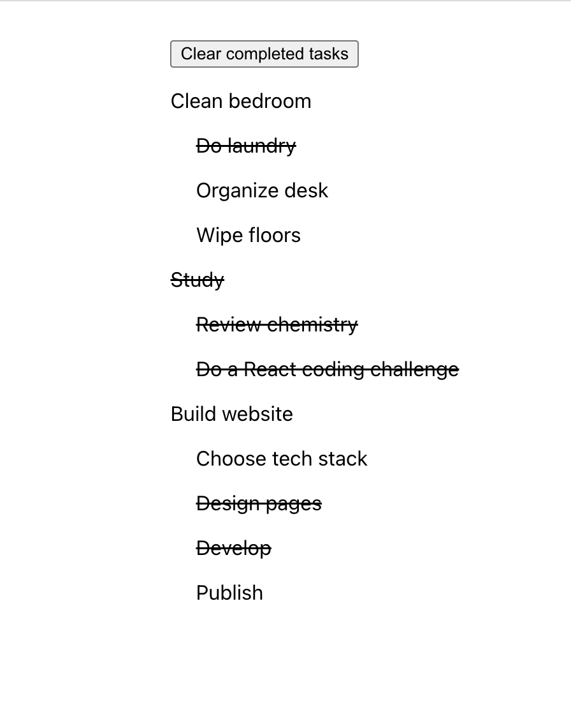

Your component should render a vertical list of the tasks along with the subtasks in an indented list below their associated task. The user should be able to toggle any subtask as completed/uncompleted by clicking on its text. Tasks do not need to be clickable. A completed subtask should appear as struck text. When all subtasks for a particular task are completed, the task should also appear struck through. Finally, include a button that removes all completed tasks and their associated subtasks when pressed (it should not remove completed subtasks associated with uncompleted tasks). The picture below shows the completed component after a user has clicked a few subtasks.

 

 

If the user were to click “Clear completed tasks” on the image above, only the “Study” task and its associated subtasks would be removed:
